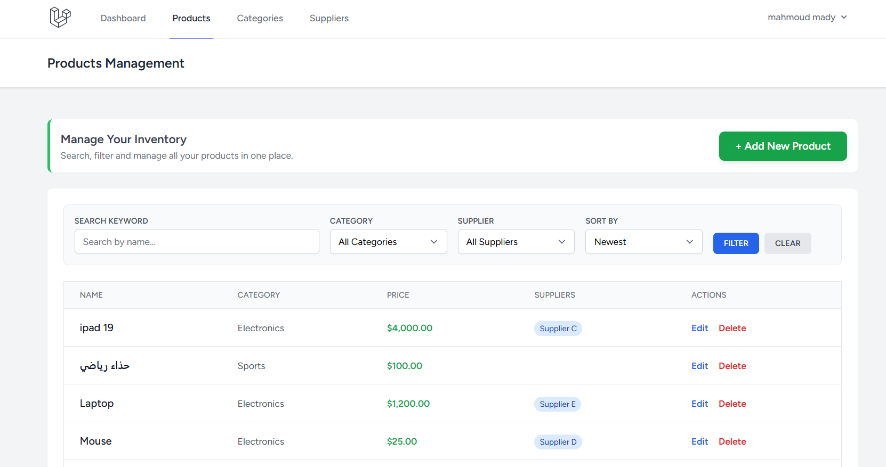

# 📦 Task 09: Products Listing Pro & Admin Dashboard

## 🚀 Project Overview

This task marks a major upgrade to the product management system, moving from a simple list to a  **production-style listing page** . It provides a seamless experience for browsing real-world data through advanced searching, filtering, and a dedicated statistical dashboard.

## ✨ Key Features

### 1. Advanced Product Listing

* **Smart Search:** Search products by name or description with instant results.
* **Multi-Filter System:** Combine filters for **Categories** and **Suppliers** to narrow down the inventory.
* **Dynamic Sorting:** Sort the list by **Price** (High/Low), **Name** (A-Z), or **Date Added** (Newest/Oldest).
* **Pagination with Query Persistence:** Navigate through pages without losing your active search or filter settings.

### 2. Enhanced Admin Dashboard

* **Real-time Statistics:** Summary cards displaying total counts for Products, Categories, and Suppliers.
* **Activity Monitoring:** A "Latest 5 Products" table for quick oversight of recent additions.
* **Financial Highlight:** Integrated a **Price column** with professional currency formatting and color coding (Green) for better visibility.

### 3. Professional UI/UX

* **Responsive Toolbar:** A modern filter bar built with Tailwind CSS that adapts to all screen sizes.
* **Empty State Handling:** User-friendly messages when no products match the search criteria.
* **Clean Layout:** Optimized table views with clear action buttons and data badges.

## 🛠️ Technical Implementation

* **Eager Loading:** Used `with(['category', 'user', 'suppliers'])` to ensure high performance and prevent N+1 query issues.
* **Safe Sorting:** Implemented a whitelist for allowed sort fields to prevent SQL injection.
* **Fluent Queries:** Built dynamic queries in the Controller to handle multiple optional filters gracefully.

