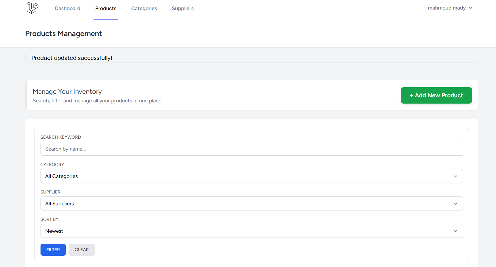

# 📦 Inventory Management System - Week 9 🚀


نظام إدارة مخزون متقدم تم بناؤه باستخدام **Laravel**، يركز على إدارة المنتجات وعلاقاتها بالفئات والموردين مع نظام بحث وفلترة ذكي.

## 🛠 التطور البرمجي (Task 09 - Products Pro)

في هذا الأسبوع، تم تحويل صفحة المنتجات من جدول بسيط إلى لوحة تحكم إدارية احترافية تدعم:

- **Advanced Search:** بحث نصي ذكي عن المنتجات بالاسم والوصف.
- **Dynamic Filtering:** تصفية النتائج بناءً على الفئة (Category) والمورد (Supplier) بشكل متزامن.
- **Smart Sorting:** ترتيب المنتجات حسب السعر (من الأقل للأعلى والعكس)، الاسم، أو تاريخ الإضافة.
- **Pagination & Persistence:** نظام ترقيم الصفحات مع الحفاظ على مدخلات البحث عند التنقل بين الصفحات باستخدام `withQueryString()`.
- **UI Enhancements:** واجهة مستخدم محسنة باستخدام Tailwind CSS مع زر إضافة منتج بارز وعمود مخصص للسعر.

## 📂 هيكل المشروع (Database Schema)

- **Products:** (id, name, price, category_id, user_id).
- **Categories:** (id, name).
- **Suppliers:** (id, name, email).
- **Pivot Table:** (product_supplier) لربط المنتجات بالموردين (Many-to-Many).

## 🚀 طريقة التشغيل

بعد تحميل المشروع، نفذ الأوامر التالية:

```bash
composer install
npm install && npm run dev
php artisan migrate --seed
php artisan serve
```



